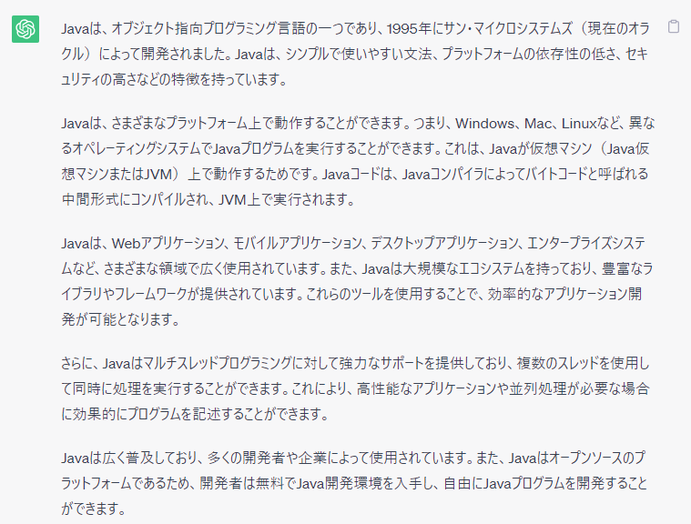
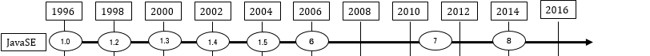
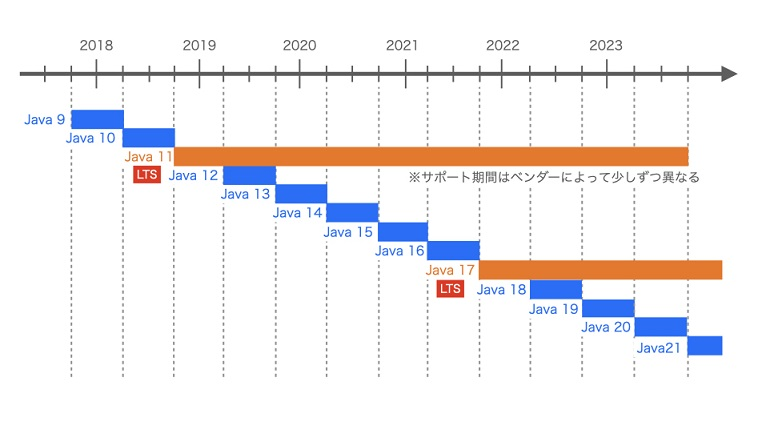
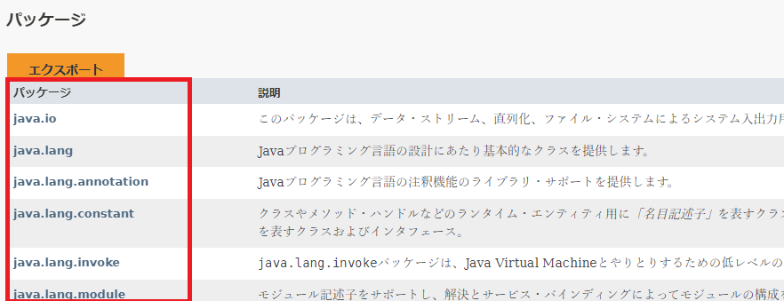
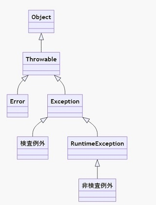
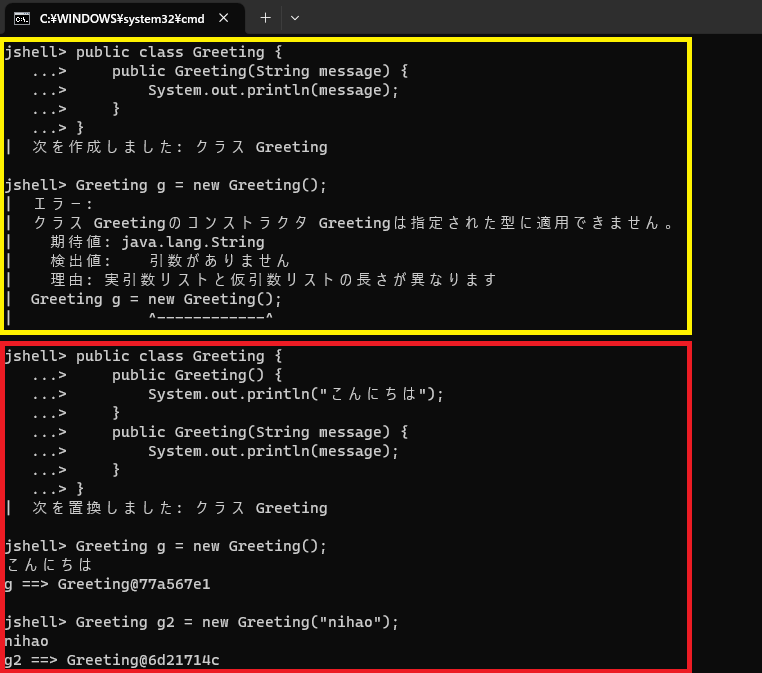
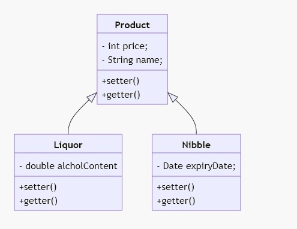

<!--
headingDivider: 1
-->

# Java 入門

## 2023/07/02

# 自己紹介

## モメンコ@五反田だいすき(`@mome1014`)


- 飲酒が趣味
  - お酒があるところは交通機関でいけるところはどこでも行きます。

# Java とは？

- chatGPT にきいてみました。
  

---

- 1995 年に米国の Sun Microsystems 社が開発したプログラミング言語です。2010 年に Oracle 社に吸収合併され、その後は Oracle 社が Java を提供している。
- `Write once, Run anywhere`
  - Java でコーディングすれば、OS 問わずプログラムの実行ができる
- 世界中で使っている人が多いため、バグが起きても修正されやすく安定している。
- 利用シーンが多いため、エンジニアに需要がある？！？
  - はずなのに、今の会社では少数派閥な模様…（さみしい）
- 親の顔より見た[ひしだまさんのページ](http://www.ne.jp/asahi/hishidama/home/tech/java/)

# Java の歴史

- Java8 まで (出典:1)
  
  - （だいたい）1 年ペースくらいでバージョンが上がっている。
  - 1.x と言っていた時代があった。
    - この頃は、Java だけで月刊誌(Java World)が出るくらいの勢いがあった。
    - 眺めるだけで震えるほどのメーリングリストが存在した。(Java House)
      - 今はアーカイブでしか確認ができないが、元ファイルのコーデイングが SJIS なのか、歴史を感じている。
    - 1.4 → 1.5 にバージョンが上がった時に、拡張 for 文に現場が沸いた。

---

- 1.4 まで

```java
String[] args = new String[]{"aaa", "bbb", "ccc"};
for (int i = 0; i < args.length; i++) {
  System.out.println(args[i]);
}
```

- 5 から

```java
String[] args = new String[]{"aaa", "bbb", "ccc"};
for (String str : args) {
  System.out.println(str)
}
```

---

- Java9 以降(出典:2)
  
  - 半年ペースでバージョンが上がっている。
    - 3 年（6 バージョン）ごとに LTS（Long Term Support）と呼ばれるバージョンが設定されている。

---

- Java9 で JShell, 10 で型推論…
  - 新しいバージョンが出ると、jjug のイベントやきしだなおきさんの Qiita のページで勉強しています。
    - [きしだなおきさん`@nowokay`の Qiita](https://qiita.com/nowokay)

# Java の実行方式

- 基本的にはコンパイラ方式

  - 事前にコンパイルが必要
    - 他の代表的な言語：C/C++

- Java の実行方式

  - Java は基本的にはコンパイル方式の言語
    - Java 仮想マシンの機械語に翻訳され、仮想マシン上で実行される。コンパイル方式とインタープリタ方式の中間的な方式。
      - Java 仮想マシンの機械語に翻訳されたプログラムは，仮想マシンさえあれば，どこでも同じように動作する。
      - JIT コンパイラなどの技術によって、高速に実行できるようになっている。

# 開発に必要なもの

- JDK (Java Developer Tool)

  - コンパイラー(javac コマンド)
  - Java の実行環境(Java 仮想マシン、JVM)

- IDE
  - 今日は使いませんがお好みのものでどうぞ。
    - eclipse : 歴史が長い
      - https://mergedoc.osdn.jp/
    - InteliJ IDEA 　：ナウい
      - https://www.jetbrains.com/ja-jp/idea/
    - VSCode ：ナウい
      - `Extension pack for Java` を入れておけば OK です。

# コンパイルと実行

- HelloWorld

  - HelloWorld.java をつくる

  ```java
  public class HelloWorld {
      public static void main(String[] args) {
        System.out.println("Hello World");
      }
  }
  ```

  - コンパイルする(クラスファイルの作成)

  ```cmd
  javac HelloWorld.java
  ```

  - 実行する

  ```cmd
  java HelloWorld
  ```

# JShell

- Java9 から導入された、Java のコードを 1 行ずつ対話的に実行することができるツール。

  - 導入されて以来、main メソッドを書くことが激減した。(手軽に色々試せるのがよき)

- 起動

  - Windows ユーザはコマンドプロンプト、Mac/Linux ユーザはターミナルで開いてください。

  ```cmd
  $ jshell
  ```

- 終了
  ```cmd
  jshell > /exit
  ```

---

- プレビュー版をためす

  ```cmd
  $ jshell  --enable-preview
  ```

  > 新しい機能が正式な機能として取り込まれる前に、
  > Java の構文・文法に関する試験的に提供される機能。(出典:3)

# JShell で HelloWorld

```cmd
jshell> System.out.println("Hello World");
Hello World

jshell> "HelloWorld";
$2 ==> "HelloWorld"
```

# JShell のショートカット

- Windows の場合(mac も基本的に変わらないです。control の下にある上向きの矢印、control の上のある左向きの矢印を駆使してください。)
  - クラスのインポート
    - インポートしたいクラスを入力し、`Shift`を押しながら`tab`を押した後、`i`　を入力。
  - 変数の宣言
    - 変数の値を入力し`Shift`を押しながら`tab`を押した後、`v`　を入力。
  - メソッドの宣言
    - 変数の値を入力し`Shift`を押しながら`tab`を押した後、`m`　を入力。
  - 履歴の検索
    - `Ctrl` + `r`

# Java アプリケーションの基本（ざっくり）

- パッケージ
- クラス
- クラスとインスタンス
- main メソッド

# パッケージ

- Java のクラスをまとめて分類するための仕組み
  
  > [18 の javadoc](https://docs.oracle.com/javase/jp/18/docs/api/index.html)

# クラス

- データ（フィールド）、処理（メソッド）を定義。
- 設計図や型枠のイメージ

```java
// パッケージ
package com.example;
// クラスの宣言、親クラスの定義、インターフェースの実装
public class Developer extends Employee implements Human {
    // 定数
    private final static int DEPARTMENT_CODE = 100;
    // インスタンス変数
    private int baseSalary;
    // メソッド
    public int getBaseSalary() {
      return baseSalary;
    }
}
```

# クラスとインスタンス

- クラスからオブジェクト（インスタンス）を生成して、利用。

  - 注意) インスタンスを生成しないで利用することもできます。

- new 演算子を使用してインスタンスを生成。

  ```java
  Developer developer = new Developer();
  ```

> クラスは設計図・型枠、インスタンスは実体。

# main メソッド

- Java で処理を実行するときの入口。最初に実行されるメソッド。
- 必ずこの形（修飾子が static, 戻り値が void、引数が String の配列）

```
public static void main(String[] args) {

}
```

> 引数は`String... args` でも実行は可能。（cf. 可変長引数）

- 書かない or 書式に従っていないとどうなるか

  - コンパイルは成功するが、実行時に例外が発生。
    - `java.lang.NoSuchMethodError: main`

- Java21 からは簡素化されるもようです。
  - [Java がﾊﾟﾌﾞﾘｯｸｽﾀﾃｨｯｸｳﾞｫｲﾄﾞﾒｲﾝの呪文から解放される](https://nowokay.hatenablog.com/entry/2023/06/12/153755)

# Java の基本文法

- 文字列
- 基本データ型
- 数値
- 変数
- 型変換
- 真偽値
- 条件分岐
- 繰り返し処理
- 配列

# 文字列

- 基本データ型ではなく、`String` クラスのインスタンス -ダブルクォーテーション(")で囲う (文字列リテラル)

```java
String msg = "こんにちは"
```

> String は参照型のデータ型なので、値そのものが変数に格納されているのではなく、文字列本体のアドレスが保管されている。

- 文字列の操作については、[java.lang.String](https://docs.oracle.com/javase/jp/18/docs/api/java.base/java/lang/String.html) 参照。

# 基本データ型

| データ型 | 値                                    | 範囲                                                    |
| :------- | :------------------------------------ | :------------------------------------------------------ |
| boolean  | 真偽値                                | true or false                                           |
| char     | 16 ビット Unicode 文字                | `\u0000～\uFFFF`                                        |
| byte     | 8 ビット整数                          | -128 ～ 127                                             |
| short    | 16 ビット整数                         | -32,768 ～ 32,767                                       |
| int      | 32 ビット整数                         | -2,147,483,648 ～ 2,147,483,647                         |
| long     | 64 ビット整数                         | -9,223,372,036,854,775,808 ～ 9,223,372,036,854,775,807 |
| float    | 32 ビット単精度浮動小数点数           |                                                         |
| double   | 64 ビット 64 ビット倍精度浮動小数点数 |                                                         |

# 数値

- 基本データ型(固定長)
  - byte, short, int, long, float, double
    - 基本的には int を使う。int で扱いきれない場合は long を使う。
- 参照型（多倍長）
  - [java.math](https://docs.oracle.com/javase/jp/17/docs/api/java.base/java/math/package-summary.html) パッケージにある下記のクラスを使う
    - 整数：`BigInteger`
    - 小数：`BigDecimal`

# 変数\_1

- 変数に入れる値のデータ型を指定する

  ```java
  String name = "モメンコ";
  int age = 25;
  ```

- 代入のあれこれ

  ```java
  // 自己代入もできる
  int age = 25;
  age = age + 16;
  // 省略した書き方もできる
  age += 16;
  ```

# 変数\_2

- Java10 から型推論も利用可能となった。

  - 変数宣言時に値を代入

  ```java
  var num = 10; // int型になる
  var msg = "こんにちは"; // String型になる
  ```

  - 初期化で代入される値で型が決まるので、初期化を行わないとコンパイルエラーになる

  ```java
  // 下記はいずれも、ローカル変数numの型を推論できません、が出る
  var num;
  var num = null;
  ```

# 型変換\_1

## 自動型変換

- 文字列

  - 何もしなくても、文字列として扱ってくれる。

  ```java
  System.out.println("今日は" + 7 + "月" + 2 + "日です");
  ```

  > Jshell で試す場合は、`String today = "今日は" + 7 + "月" + 2 + ”日です;`も同義になる。

---

- 数値

  - 扱う範囲が広いデータ型に対して扱う範囲が狭いデータ型の値を代入する場合に自動で変換してくれる。

  ```java
    // int 型が double 型として扱われ、2.5 になる。
    System.out.println(5.0 / 2);
  ```

  > JShell で試す場合、`double result = 5.0 / 2;` でも同義になる。
  > `int result = 5.0 / 2;` だとエラーになるので注意。
  > （次ページの`キャスト` 参照）

# 型変換\_2

## 強制型変換

- キャスト

```java
// int同士の計算だと、小数点以下を取り扱わないため、下記は2になってしまう。
System.out.println(5 / 2);
// 正しい値を出すためにはキャストする必要がある。
System.out.println((double) 5 / 2);
```

# 真偽値

- `true` または　`false` を使う。

  - ダブルクォーテーションで囲ってしまうと文字列として取り扱われるため注意。
  - true が 1、false が 0 というわけではない。（別物）

  ```java
  System.out.println(1 == 2); #false
  System.out.println(10 > 5); #true
  ```

# 条件分岐\_1

## if 文

- 条件式を評価して true のときと false のときで別々の処理を行いたい場合に使用。

```java
if (条件式){
  // 条件式が true のときに実行される処理
  ...
} else {
  // 条件式が false のときに実行される処理
  ...
}
```

# 条件分岐\_2

## switch 文

- 式の評価結果に応じた処理を実行。3 分岐以上の多分岐処理の記述が可能。

```java
switch (式) {
　case 値1:
　　// 実行する処理1
　　break;
　case 値2:
　　// 実行する処理2
　　break;
　case 値3:
　　// 実行する処理3
　　break;
　default:
　　// 実行する処理4
}
```

# 繰り返し処理\_1

## for 文

- 指定した回数だけ処理を繰り返す時に使う。

```java
for (初期化式; 条件式; 変化式){
  // 繰り返しの中で実行される処理
  ...
}
```

- 1 から 10 まで出力する例。

```java
for (int i = 1 ; i <= 10; i++) {
  System.out.println(i);
}
```

> 最初の条件式が false となった場合には繰り返し処理が一回も行われない。

# 繰り返し処理\_2

## while 文

- 指定した条件式が真となる間は回数を決めずに処理を繰り返す時に使う

```java
while (条件式) {
  // 繰り返しの中で実行される処理
　...
}
```

- 1 から 10 まで出力する例。

```java
// 必要な変数はwhile文の前で宣言
int num = 1;
while (num <= 10) {
  System.out.println(num);
  num++; // 条件式が変化するような処理をしないと無限ループになる
}
```

> 最初の条件式が false となった場合には繰り返し処理が一回も行われない。

# 繰り返し処理\_3

## break

- for, while, switch 文で繰り返し処理を強制的に終了したい場合に使う。

```java
for (int i = 1; i <= 10; i++) {
  // iが6になった段階でfor文終了
  if (i > 5) {
    break;
  }

  System.out.println(i);
}

```

# 繰り返し処理\_4

## continue

- for, while, switch 文で 繰り返し処理のブロック内にある continue 文以降の処理をスキップし、次の繰り返し処理を行いたい場合に使う。

```java
for (int i = 1; i <= 10; i++) {
  // iが3の倍数の時、次のループを実行(iは表示されない)
  if (i % 3 == 0) {
    continue;
  }

  System.out.println(i);
}

```

# 配列\_1

- 最初に扱うデータ型を指定して配列を宣言する必要がある。
- 宣言のあとで必要な数の要素数を指定して配列を作成する必要がある。

```java
// データ型[] 配列変数名で宣言
int[] num;
// 配列変数名 = new データ型[要素数]で生成できる。
num = new int[5];
```

- 変数同様、配列にも型推論は使える。

```java
// int[] data = new int[5] と同義。型推論を使う場合は宣言 + 生成までが必要。
var data = new int[5];
```

# 配列\_2

- インデックス番号は 0 から始まる

```java
String[] names = {"一郎", "次郎", "三郎"};
// 一郎が表示される
System.out.println(names[0]);
// 代入もできる
names[0] = "モメンコ";
// モメンコが表示される
System.out.println(names[0]);
// 存在しないインデックスを指定すると、実行時にArrayIndexOutOfBoundsExceptionが発生する。
names[3] = "四郎";
```

# 例外処理\_1

- コンパイルエラー
  - コンパイル時点で発生するもの。構文の使い方の誤りやスペルミスで発生するもの。
  ```java
  // Stringは大文字始まりなので、シンボルが見つからないエラーになる。
  string test = "aaa";
  ```
- 実行時エラー
  - 配列のページで出てきた、`ArrayIndexOfBoundsException` や　親の話よりよく聞いた `NullPointerException`等がある。

# 実行時エラー

- Error 系
  - プログラムではどうしようもできないもの(OutOfMemory 等)
- Exception 系
  - 検査例外
    - 正しいプログラムを書いていても、避けられない例外(FileNotFoundException 等)
    - `try～catch`が必要。
  - 非検査例外
    - 正しいプログラムを書くことで避けられる例外(NullPointerException 等)
      

# 実行時エラーの捕捉\_1

- 検査例外は、`try～catch`（Error 系、非検査例外は捕捉不要。）が必要

```java
try {
  // 例外が発生しているかどうか調べる文1;
  // 例外が発生しているかどうか調べる文2;
  ...
} catch (例外クラス1 変数名1) {
  例外クラス1の例外が発生した時に行う文;
  ...
} catch (例外クラス2 変数名2) {
  例外クラス2の例外が発生した時に行う文;
  ...
}
```

# 実行時エラーの捕捉\_2

- ファイルの読み込みの例

```java
public class FileNotFoundExceptionExample {
    public static void main(String args[]) {
        BufferedReader br = null;

        try {
            br = new BufferedReader(new FileReader("myfile.txt"));
            String data = null;

            while ((data = br.readLine()) != null) {
                System.out.println(data);
            }
        } catch (IOException ioe) {
            ioe.printStackTrace();
        } finally { // 前のページには出ていないが、必ずやりたいことはfinallyで。
            try {
                if (br != null) {
                    br.close();
                }
            } catch (IOException ioe) {
                ioe.printStackTrace();
            }
        }
    }
}
```

# クラスとメソッド\_1

## クラス

- 定義

```java
public(※1) class クラス名{
}
```

- クラスに書くこと
  - フィールド、メソッド、コンストラクタ（後ほど出てきます）を書く。

---

(※1) 修飾子
|種類|説明|
|:---|:---|
|public|どこからでもアクセス可能|
|protected | 同一パッケージ内、サブクラスからアクセス可能|
|なし|同一パッケージ内|
|private| 同一クラス内のみ|

> cf. Java の予約語

---

- クラスを作成する場合のお約束
  - 基本的には 1 クラス 1 ファイル
    - 例外もある：cf. インナークラス（内部クラス）
  - 先頭文字は大文字、それ以降は小文字。
  - 先頭文字には数字は使えない。
  - 名前の区切り大文字にする。

# クラスとメソッド\_2

# メソッド

- 定義

```
public class クラス名 {
  public(※1) void(※2) メソッド名(引数1, 引数2) {

  }
}
```

- クラスの中に記述する。
- 複数の引数はカンマで区切る
  - 引数を動的に扱う事もできる（cf. 可変引数）※3

---

(※1) 修飾子
|種類|説明|
|:---|:---|
|public|どこからでもアクセス可能|
|protected | 同一パッケージ内、サブクラスからアクセス可能|
|なし|同一パッケージ内|
|private| 同一クラス内のみ|
|abstract | 実装を持たない抽象メソッド|
|final | オーバーライドできない|
|static |静的メソッド|

---

(※2) 戻り値

- データの型が指定できる。(前のほうで出てきた基本データ型、参照型が指定できる)
  - 戻りの型がある場合は、メソッドの中で`return` キーワードを用いて値を返却する。
- 値を戻す必要がない場合は、`void` を指定する。

  ```java
  // 戻り値あり
  public int add(int a, int b) {
    return b;
  }

  // 戻り値なし
  public void print() {
      System.out.println("ただ文字列を表示するだけ。");
  }
  ```

---

(※3) 引数

- 型、変数名で記載する。

```java
// 固定引数（個数が決まっている）
public void add(int a, int b) {
  System.out.println("result=" + a + b);
}

// 可変引数は...で表す。引数がいくつ来ても良い。
public void add (int... numbers) {
  int result = 0;
  // 突然の拡張forループ。int = i; i < numbers.length; i++でなくても良い例。
  for (int number : numbers) {
    result += number;
  }

  // add(1,2,3,4,5)で実行するとresult=15になる。
  System.out.println("result=" + result);
}
```

---

- メソッドを作成する際のおやくそく
  - 先頭は必ず小文字。
  - 名前の区切りは大文字にする。

---

- static メソッド

  - 修飾子に`static`を付けることで、クラスをインスタンス化することなく使える。

  ```java
  public class Message {
    public static showMessage(String message) {
      System.out.println(message);
    }
  }
  ```

  - 呼び出すときは、クラス名.メソッド名で呼べる。

  ```java
  // こんにちは！が表示される。
  Message.showMessage("こんにちは");
  ```

---

- オーバーロード

  - 同じクラスの中でメソッド名と`戻り値の型が同じ`で、引数の型や数、並び順が違うメソッドを 複数定義すること。
    - 戻り値の違いのみでメソッドのオーバーロードを定義することはできない。

---

- オーバーロードを使う前

```java
public static void main(String args[]){
  int n = plusInt(10, 7);
  System.out.println(n);

  double d = plusDouble(3.14, 7.4);
  System.out.println(d);
}

private static int plusInt(int n1, int n2){
  return n1 + n2;
}

private static double plusDouble(double d1, double d2){
  return d1 + d2;
}

```

---

- オーバーロードを使ったあと

```java
public static void main(String args[]){
  int n = plus(10, 7);
  System.out.println(n);

  double d = plus(3.14, 7.4);
  System.out.println(d);
}

// OK
private static int plus(int n1, int n2){
  return n1 + n2;
}

// OK
private static double plus(double d1, double d2){
  return d1 + d2;
}

// NG (戻り値がint型のメソッドの引数と見分けがつかないのでコンパイルエラーになる)
// private static long plus(int n1, int n2) {
//
// }

```

> (名前を分けたほうが良い場合もあるが)メソッド名を同じにしておけば引数のデータ型を意識することなく利用することができる。

---

- メソッドの組み合わせ

  - “.”を使ってメソッドを繋げて呼び出す方法。
    - シンプルに記載ができるが、戻り値を意識せずに使うと意図せぬ結果になってしまうこともあるので無理につなげる必要はない。

- よくある例

  ```java
  System.out.println("test");
  ```

  > System というクラスの out というフィールドにおいて println メソッドを呼び出す、という意。

---

- 実例

```java
public class Student {
  private String name;
  private int age;

  public Student setName(String name) {
    this.name = name;
    return this;
  }

  public Student setAge(int age) {
    this.age = age;
    return this;
  }

  public void detail() {
    System.out.println("name=" + name + "\age=" + age);
  }

  public static void main(String[] args) {
    Student student = new Student();
    // まとめて呼べる。name=太郎[改行]age=20が表示される。
    student.setName("太郎").setAge(20).detail();
  }
}
```

# クラスとメソッド\_3

- ライブラリを使う

  - クラス上部で import して使う。

  ```java
  // 使いたい機能のimportをクラス上部で宣言
  import java.time.LocalDate;

  public class LocalDateSample {
    public static void main(String[] args) {
      LocalDate ld = LocalDate.now();
      System.out.println(ld);
    }
  }
  ```

  > java.lang パッケージは import する必要はない。（コンパイラが勝手に import してくれる）
  > そのため、System.out ～は何も import しなくても使えている。

# オブジェクト指向

- オブジェクト指向とは
- クラスとインスタンス
- インスタンスメソッド/インスタンスフィールド
- this
- コンストラクタ
- カプセル化

---

- 継承
  - スーパークラス/サブクラス
  - メソッドのオーバーライド
  - super
  - コンストラクタと super
  - 抽象メソッド、抽象クラス

# オブジェクト指向とは

- オブジェクト単位でシステムを組み立てることでシステム開発・保守を効率化する考え方。

- (プログラミングには)いくつかのアプローチがあるもののうちのひとつ。
  |手法|概要|
  |:---|:---|
  |手続き型プログラミング|プログラムの処理が順番に記述され、上から順に動作する|
  |オブジェクト指向プログラミング|「モノ」と「モノ同士の関係性」を定義して組み立てる手法|
  > 対比のため二つしか列挙していないが、関数型やマルチパラダイム等がある。

# クラスとインスタンス

- クラス

  - 「インスタンスを生成する際に用いられる設計図」の役割を持つもの。

  ```java
  public class Student {
    // フィールド（設計するものの属性)
    private String name;
    private int age;

    // メソッド（設計するものの操作）
    public Student setName(String name) {
      this.name = name;
      return this;
    }

    public Student setAge(int age) {
      this.age = age;
      return this;
    }
  }
  ```

---

- インスタンス

  - クラスから作られたオブジェクト。
    > クラスはただの設計図であり、その設計図から「もの」を作らなければ実際に使えない。

  ```java
  public class Main {
    public static void main(String[] args) {
      Student s1 = new Student();
      Student s2 = new Student();
    }
  }

  ```

# インスタンスフィールド/インスタンスメソッド

- インスタンスフィールド
  - インスタンスの情報にあたるもの（変数）
    - Student クラスの name, age
- インスタンスメソッド
  - インスタンス情報のふるまいにあたるもの
    - Student クラスの setName, setAge

# this

- 自分自身のインスタンスを指す変数です。変数を使って、その変数が指すインスタンスのフィールドやメソッドを参照したり呼び出せるのと同じように、自分自身のインスタンスを明示的に指し示し、そのフィールドやメソッドを使いたい時に使う変数。

> cf. メソッドの組み合わせのページにある、Student クラス参照。(setName, setAge メソッド)

# コンストラクタ

- クラスからオブジェクトを作成した際に、自動的に実行されるメソッドのことで、メンバ変数の初期化等を行う。
- コンストラクタのおやくそく
  - コンストラクタ名とクラス名を同一にする。
  - 戻り値を記載しない。

---

```java
public class Greeting() {
  // 引数のないコンストラクタはデフォルトコンストラクタと呼ばれる
  // 記載しなくても、内部では持っている（処理がない場合はわざわざ書かなくて良い）※1
  public Greeting() {
    System.out.println("こんにちは");
  }

  // オーバーロードもできる。
  public Greeting(String message) {
    System.out.println(message);
  }
}
```

> (※1) オーバーロードしたものが存在する場合、明示的に記載しないと引数なしでのインスタンス生成ができなくなるので注意。

---



# カプセル化

- 隠ぺいされているメンバを、他クラスからメソッドを通してのみ操作できるようにアクセスを制限する機能。

- 他クラスから隠ぺいされている
  - メンバ(変数)
    - private で宣言し、直接操作させないようにする。
  - アクセサ（メンバを操作するメソッド）
    - getter/setter

---

```java
public class MyNumber {
  private String name;
  private String myNumber;

  public String getName() {
    return name;
  }

  public void setName(String name) {
    this.name = name;
  }

  public String getMyNumber() {
    return myNuber;
  }

  public void setMyNumber(String myNumber) {
    this.myNumber = myNumber;
  }

  public void showMyNumber() {
    System.out.println("氏名=" + name + " 番号=" + myNumber);
  }
}
```

---

```java
public class Main {
  public static void main(String[] args) {
    MyNmber mine = new MyNumber();
    mine.setName("モメンコ");
    mine.setNumber("123456789");
    mine.showNumber(); // 氏名=モメンコ 番号=123456789 が表示される
  }
}
```

> 値が勝手に参照されたり、変更されたしないように隠ぺいしている。

# 継承

- 既存のクラスの属性と操作を受け継いで新しいクラスを作成すること。
- 既存のクラスは`スーパークラス`と呼ばれ、新しいクラスは`サブクラス`と呼ばれる。

---

## スーパークラス/サブクラス

- みんな大好き（？）カクヤスさんの例で見てみましょう。
  

---

- 商品のクラス

```java
public class Product {
  private String name;
  private int price;

  public String getName() {
    return name;
  }

  public void setName(String names) {
    this.name = name;
  }

  public int getPrice() {
    return price;
  }

  public void setPrice(int price) {
    this.price = price;
  }

}
```

---

- お酒のクラス

```java
public class Liquor extends Product{
  private double alcholContent;

  private double getAlcholContent() {
    return alcholContent;
  }

  public void setAlcholContent(double alcholContent) {
    this.alcholContent = alcholContent;
  }
}
```

---

- おつまみのクラス

```java
public class Nibble extends Product {
  private Date expiryDate;

  public Date getExpiryDate() {
    return expiryDate;
  }

  public void setExpiryDate(Date expiryDate) {
    this.expiryDate = expiryDate;
  }

}
```

---

- 実際に呼び出すクラス

```java
public class OutputProduct {
  public static void main(String[] args) {
    // スーパークラスを使う
    Product otherProduct = new Product();
    otherProduct.setName("氷");
    otherProduct.setPrice(100);
    // 氷は100円です
    System.out.println(otherProduct.getName() + "は" + otherProduct.getPrice() + "円です");

    // サブクラスを使う
    Liquor syochu = new Liquor();
    syocyu.setName("いいちこ");
    syochu.setPrice(1800);
    syochu.setAlcholContent(20d);
    // いいちこは度数が20.0度で1800円です。
    System.out.println(syochu.getName() + "は度数が" + syochu.getAlcholContent() + "度で" + syochu.getPrice() + "円です");
  }
}
```

---

- 継承のおやくそく
  - `extends` のあとは 1 つしかクラスを指定することができない（多重継承の禁止）
    - 複数実装したい場合はインターフェースを用いる(`implements`　キーワードを用いる。こちらはカンマ区切りで複数指定ができる。)

# メソッドのオーバーライド

- 継承したスーパークラスのメソッドの内容を、サブクラスで上書き(再定義)すること。
  - スーパークラスで定義したメソッドと目的が同じで、処理が異なるメソッドを定義する場合に使う
  - サブクラスがインスタンス化され、オーバーライドされたメソッドが呼び出されたときは、サブクラスで上書きしたメソッドが優先的に呼び出される。

---

- 商品のクラス

```java
public class Product {
  private String name;
  private int price;

  public String getName() {
    return name;
  }

  public void setName(String names) {
    this.name = name;
  }

  public int getPrice() {
    return price;
  }

  public void setPrice(int price) {
    this.price = price;
  }

}
```

---

- お酒のクラス

```java
public class Liquor extends Product{
  private double alcholContent;

  public int getPrice() {
    return super.getPrice();
  }

  public void setPrice(int price) {
    int newPrice = price * 2;
    super.setPrice(newPrice);
  }

  private double getAlcholContent() {
    return alcholContent;
  }

---
  public void setAlcholContent(double alcholContent) {
    this.alcholContent = alcholContent;
  }
}
```

---

- 実際に呼び出すクラス

```java
public class OutputProduct {
   public static void main(String[] args) {
    // スーパークラスを使う
    Product otherProduct = new Product();
    otherProduct.setName("氷");
    otherProduct.setPrice(100);
    // 氷は100円です
    System.out.println(otherProduct.getName() + "は" + otherProduct.getPrice() + "円です");

    // サブクラスを使う
    Liquor syochu = new Liquor();
    syochu.setName("いいちこ");
    syochu.setPrice(1800);
    syochu.setAlcholContent(20d);
    // いいちこは度数が20.0度で3600円です。 (たかいな。買えねえ。)
    System.out.println(syochu.getName() + "は度数が" + syochu.getAlcholContent() + "度で" + syochu.getPrice() + "円です");
  }
}
```

# super

- サブクラスからスーパークラスのメソッドを呼びたいときは、super を使用する。
- `super` は 今より 1 (つ内側のインスタンス部分をあらわす。)　(1 つより上は呼び出せない。)

```java
// サブクラスからスーパークラスのフィールドを呼び出すとき
super.フィールド名;

// サブクラスからスーパークラスのメソッドを呼び出すとき
super.メソッド名(引数);
```

> cf. 例はひとつ前のページのオーバーライドに出ています。

# コンストラクタと super

- コンストラクタは継承されない。
  - クラスのインスタンス化時には、継承階層の最上位から下に下ってインスタンス化されていく。
  - サブクラスのコンストラクタは最初にスーパークラスのコンストラクタを呼び出す。
    - スーパークラスのコンストラクタを明示的に呼び出さない場合、自動的に引数のないコンストラクタが呼び出される。

---

```java
public class Parent {
  public Parent() {
    System.out.println("This is Parent.");
  }
}
```

```java
public class Child extends Parent {
  public Child() {
    System.out.println("This is Child.");
  }
}
```

```java
public class Main {
  public static void main(String[] args) {
    Child child = new Child();
  }
}
```

- 実行結果
  > This is Parent.
  > This is Child.

# 抽象メソッド、抽象クラス

- 抽象メソッド
  - メソッドの先頭に`abstruct`を付ける。
  - 中身の処理は書かない。
- 抽象クラス

  - 抽象メソッドを持つクラス。
  - インスタンス化することできない。

- クラスを継承する時にスーパークラスで定義されたメソッドを、サブクラスにてオーバーライド(上書き)することができるが、サブクラスで必ずオーバーライドされるようなメソッドがある場合に利用する。

---

```java
public abstract class BatchBase {

  public void execute() {
    start();
    process();
    end();
  }

  public void start() {
    System.out.println("----- start -----");
  }

  public abstract void process();

  public void end() {
    System.out.println("----- end -----");
  }
}
```

---

```java
public class BatchA extends BatchBase {
  public void process() {
    System.out.println("Batch A process");
  }
}
```

```java
public class BatchB extends BatchBase {
  public void process() {
    System.out.println("Batch B process");
  }
}
```

---

```java
public class Main {
  public static void main(String[] args) {
    BatchBase batchA = new BatchA();
    batchA.execute();
    BatchBase batchB = new BatchB();
    batchB.execute();
  }
}
```

- 実行結果
  > ----- start -----
  > Batch A process
  > ----- end -----
  > ----- start -----
  > Batch B process
  > ----- end -----

# インターフェースとポリモーフィズム

- インターフェース

  - クラスがどんなメソッドを持っているかを定義する。
  - 定義するのは引数、戻りの型のみ定義する。（処理は書かない。）

- ポリモーフィズム（多態性）
  - オブジェクト指向において、重要な概念のひとつで、複数のオブジェクトが同じ命令に対して違う挙動を行うことを可能とすること。

---

```java
public interface Animal {
  public void bark();
}
```

```java
public class Dog implements Animal {
  public void bark() {
    System.out.println("Bow-Wow");
  }
}
```

```java
public class Cat implements Animal {
  public void bark() {
    System.out.println("Meow");
  }
}
```

---

```java
public class Main {
  public static void main(String[] args) {
    Animal dog = new Dog();
    dog.bark();
    Animal cat = new Cat();
    cat.bark();
  }
}

```

- 実行結果
  > Bow-Wow
  > Meow

# やってみよう(JShell)

- (ほぼワンライナーで行ける系) 文字列を操作してみよう

```java
String s = "Hello";
// 長さを求める
s.length();
// 0文字目から2文字目までを返してくれる
s.substring(0,3);
```

> どんなメソッドがあるかは、javadoc で確認してみましょう。
> [String の javadoc](https://docs.oracle.com/javase/jp/18/docs/api/java.base/java/lang/String.html)
> Java API String

---

- (ちょっと根気がいる系) 外部 API を実行して結果を取得してみよう

```java
import java.net.http.*;
var client = HttpClient.newHttpClient();
// 引数にGETで結果が返ってきそうなURLを指定してください。
var uri = new URI("https://www.kakuyasu.co.jp/store/commodity/0010/00005472/");
var request = HttpRequest.newBuilder().uri(uri).build();
var response = client.send(request, HttpResponse.BodyHandlers.ofString());
System.out.println(response.body());
```

---

- (めっちゃ根気がいる系) BMI を計算してみよう

  - 壮大な長編大作になるので、JShell じゃないほうがいいかもしれない。（ガッツのある方は 1 行ずつ写経で…）

    - git にあります。(`example/bmi`　参照)
      - クラスファイル作って、コンパイルして実行
        - 日本語が含まれるので、コンパイル時はオプションが必要
          - `javac -encoding utf-8 CalculateBMI.java`
      - 実行
        - `java CalculateBMI`

  - JShell でやる場合はコピペで問題ないが実行時は、main メソッドを呼ぶ必要がある。

    ```cmd
    jshell> CalculateBMI test = new CalculateBMI();
    test ==> CalculateBMI@5649fd9b
    // 引数は使わないのでnullで良い
    test.main(null);
    ```

# 出典

1. [Java の基本知識の解答続き](https://gakumon.tech/java/java_knowledge_answer_3.html)
2. [2022 年の Java まるわかり！最新バージョンから Java を取り巻く環境まで](https://gihyo.jp/article/2022/07/java2022-0701)
3. [Java プレビュー版](https://www.ne.jp/asahi/hishidama/home/tech/java/preview/index.html)

# 参考資料

- Java の歴史
  - [Java SE と JDK、JRE、JVM の違いに関する解説](https://www.javadrive.jp/start/install/index5.html#section5)
  - [IT 用語辞典（JDK）](https://e-words.jp/w/JDK.html)
- [インタープリタ方式とコンパイル方式](https://www3.cuc.ac.jp/~miyata/classes/prg1/02/2way.html)

- JShell
  - [JShell の概要(oracle)](https://docs.oracle.com/javase/jp/9/jshell/introduction-jshell.htm)
  - [JShell で始める Java 入門 - Java の世界を覗いてみる](https://qiita.com/nowokay/items/e0b9c676567134e4a622)
  - [JShell(ひしだまさんのページ)](https://www.ne.jp/asahi/hishidama/home/tech/java/jshell/index.html)

---

- Java の基本文法等

  - [Java 入門](https://www.javadrive.jp/start/)

- 整数

  - [java の int と Integer と BigInteger の違いや float や double を理解する](https://qiita.com/suzuki-hoge/items/dcf86a48404ec3bb258c)

- 例外

  - [Java クラスの Error と Exception と RuntimeException について](https://it-kyujin.jp/article/detail/511/)
  - [How to Fix the FileNotFoundException in Java.io](https://rollbar.com/blog/java-filenotfoundexception/)

- 多重継承が認められていない件

  - [何故 Java では多重継承は許されていないのか](https://ja.何故Javaでは多重継承は許されていないのかstackoverflow.com/questions/25461/%E4%BD%95%E6%95%85java%E3%81%A7%E3%81%AF%E5%A4%9A%E9%87%8D%E7%B6%99%E6%89%BF%E3%81%AF%E8%A8%B1%E3%81%95%E3%82%8C%E3%81%A6%E3%81%84%E3%81%AA%E3%81%84%E3%81%AE%E3%81%8B)

---

- メソッドの組み合わせ

  - [Method Chaining in Java](https://www.javatpoint.com/method-chaining-in-java)
  - [Java のメソッドチェーンについて現役エンジニアが解説【初心者向け】](https://magazine.techacademy.jp/magazine/31905)

- オブジェクト指向

  - [Java におけるオブジェクト指向入門](https://www.javadrive.jp/start/about/)
  - [オブジェクト指向とは｜例えを交えてわかりやすく【徹底解説】](https://techmania.jp/blog/programming0004/)
  - [WEB+DB PRESS Vol.132](https://gihyo.jp/magazine/wdpress/archive/2023/vol132)
  - [Java のインスタンス化とは？クラスとの関係や生成方法をわかりやすく解説](https://camp.trainocate.co.jp/magazine/java-instance/)
  - [Java の this を総ざらい! this/this()の意味・使い方](https://www.bold.ne.jp/engineer-club/java-this#-this-2)
  - [初心者のための Java 基礎](https://zenn.dev/odentravel/books/c893bb0b7352f6/viewer/870c42)
  - [【Java】継承とオーバーライド](https://zenn.dev/miya_akari/articles/21387880393fb2)
  - [Java の interface とは？インターフェースの使い方や abstract クラスとの違い](https://camp.trainocate.co.jp/magazine/java-interface-abstract/)
