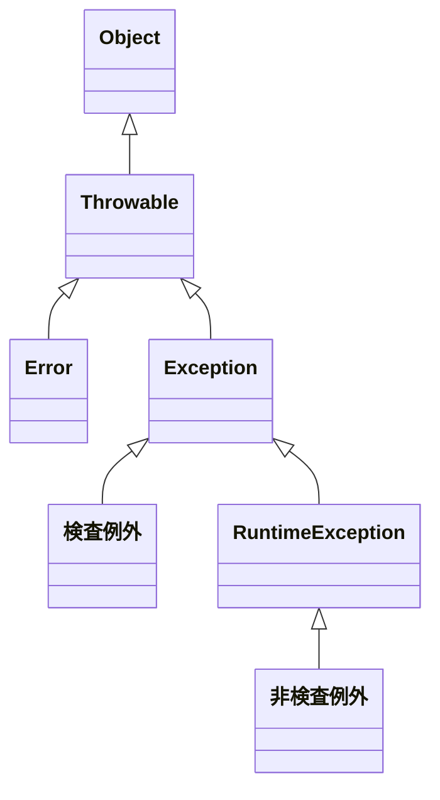
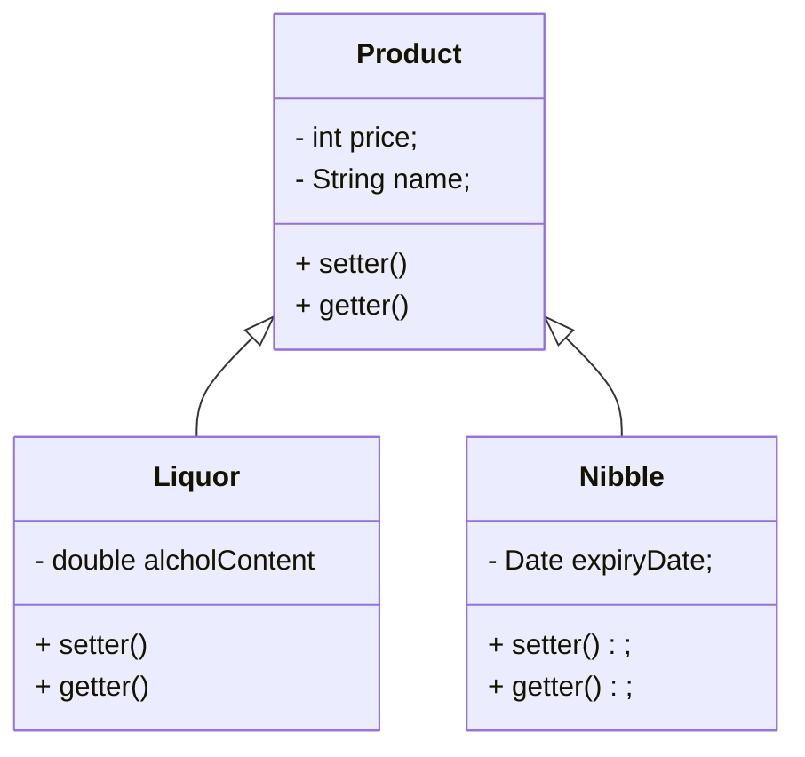

# 例外

```mermaid
classDiagram
Object <|-- Throwable
Throwable <|-- Error
Throwable <|-- Exception
Exception <|-- 検査例外
Exception <|-- RuntimeException
RuntimeException <|-- 非検査例外
```

# 継承

```mermaid
classDiagram
Product <|-- Liquor
Product <|-- Nibble

class Product {
  - int price;
  - String name;
  + setter()
  + getter()
}

class Liquor {
    - double alcholContent
    + setter()
    + getter()
}

class Nibble {
    - Date expiryDate;
    + setter();
    + getter();
}

```
